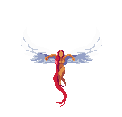
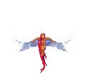
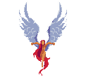
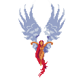
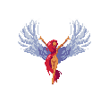

# Creators
Erick Orozco - Scene Layout/Logic & Player Assets/Logic
Sierra Morales - Enemies Assets/Logic, Boss Assets/Logic
Liliana Royer - Ingredient Assets/Logic, GameOver Logic

# Website Link
[Website](https://team-16-video-game-design.github.io/VideoGameDesign-Project2/)

# Video Links for Project
[Prototype 1](https://youtu.be/w8IWLVBEIxs)

# ASSETS

## Player
Idle: 

Jump:

Walk:

## Enemies
Soul Enemy: 

Guardian 1:
Idle:

Attack:

Projectile:

## Sandwich Ingredients

## UI
Health: 

## Enviroment
Ground:

Lava:

Parallax Backgrounds:

v
